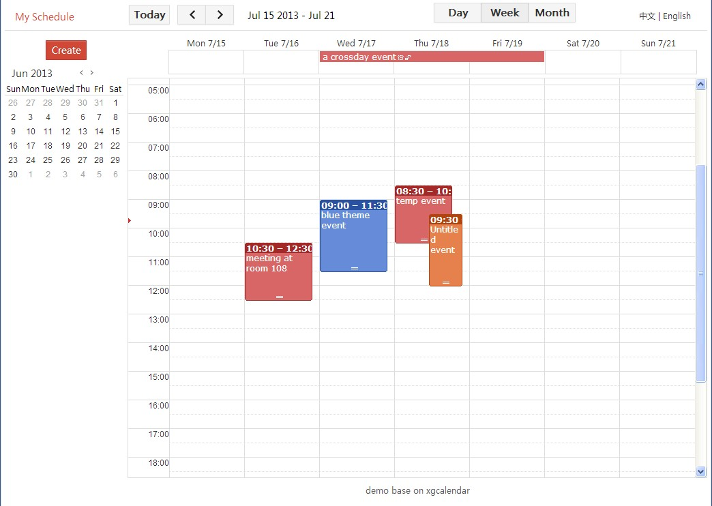
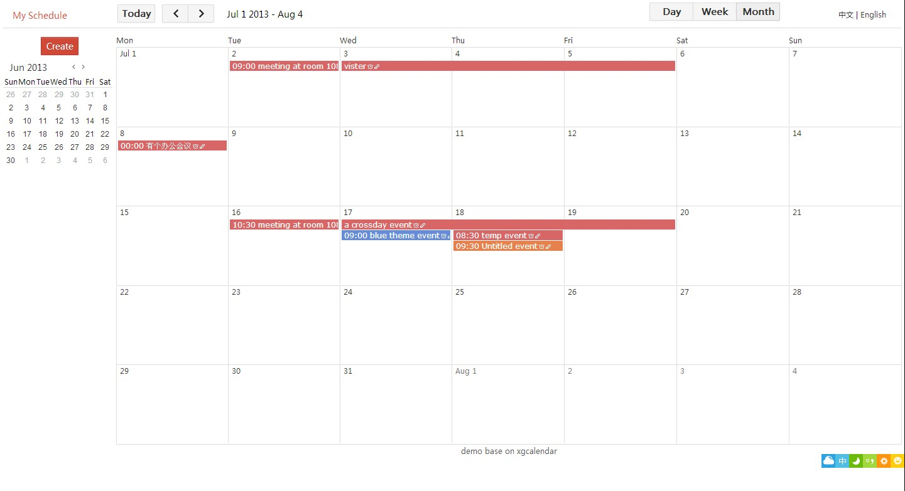

xgcalendar
========================================

google like calendar js control
a jQuery plugin that enables us to create an event calendar that functions similar to the popular Google Calendar 
why named xgcalendar? X=xuanye G=Google Calendar Like

####week view  

####month view  
  

laster demo： [http://xgcal.sinaapp.com/demo2/](http://xgcal.sinaapp.com/demo2/ "click me")  
prev version： [http://xgcal.sinaapp.com/demo/](http://xgcal.sinaapp.com/demo/ "click me")

## Features
  
  * Day/week/month view provided. 
  * Support the definition of the start date of the week 
  * Get and update data by ajax 
  * Create/update/remove events by drag & drop 
  * Quick delete 
  * Quick update by drag/drop 
  * Update event by Resize
  * Permission control
  * Theme 
  * Good performance
  * I18n
  * Support IE6+,FireFox3?.5+,Opera 10+,Chrome 3+ 

## Usage
 
html :   
 
    
calendar element

include js:

    
       

javascript :

    var op = {
        view: "week", //default view type
        theme:1,//theme style
        autoload:true,
        showday: new Date(),
        EditCmdhandler:edit,
        //DeleteCmdhandler:dcal,
        ViewCmdhandler:view,    
        onWeekOrMonthToDay:wtd,//when weekview or month switch to dayview 
        onBeforeRequestData: cal_beforerequest,
        onAfterRequestData: cal_afterrequest,
        onRequestDataError: cal_onerror, 
        url: "/calendar/query" ,  //url for get event data by ajax request(post)
        quickAddUrl: "/calendar/add" ,   //url for quick add event data by ajax request(post)
        quickUpdateUrl: "/calendar/update" ,   //url for quick update event data by ajax request(post)
        quickDeleteUrl:  "/calendar/delete"  //url for quick delete event data by ajax request(post)
    };
    var _MH = document.documentElement.clientHeight;
    op.height = _MH-70; //container height;
    op.eventItems =[]; //default event data;
    $("#xgcalendarp").bcalendar(op);

## Options
- `view`:  default view type `day`,`week`,`month` 
- `weekstartday`: First day of week, 0 for sunday, `[0-6]`, default value is `1`
- `theme`: default color style, `[0-21]`, default value is `0`
- `height`: set calendar view height，or it will be set  document.body.Height
- `url`:  **require**  load data url        
- `eventItems`: events data, it an array, you can use it to init events data
- `method`: request mode, default value `post`
- `showday`: show date, default value `new Date()`
- `onBeforeRequestData`: event on before request data, include `load`, `add`, `update`, `delete`
- `onAfterRequestData`: event on after request data,
- `onRequestDataError`: event on error occurs   
- `onWeekOrMonthToDay`: when weekview or month switch to dayview
- `quickAddHandler`: quickadd cus handler
- `quickAddUrl`: url for quick add event data by ajax request(post)
- `quickUpdateUrl`: url for quick update event data by ajax request(post)
- `quickDeleteUrl`: url for quick delete event data by ajax request(post)       
- `autoload`: if set to `true`, auto load event datas after initialization
- `readonly`: if set to `true`, control will be readonly, 
- `extParam`: other params what will be post to sever side when add,update
- `enableDrag`:
- `timeFormat`:default value：`HH:mm`, t is a PM/AM switch, h 12 hours，H 24hours, m 
- `tgtimeFormat`: "HH:mm" 

## Data format

`eventItems` 's data format
---
> eventItems is array type，the item of is also array type，item's format is as follows
> [event key,subject,startime,endtime，whether allday event，Whether cross-day event,whether repeat events,theme,right permission flags,location,attends]
> data type as follows
> [String,String,Date,Date,1/0,1/0,1/0,0-21,0/1,String,String]

## Available methods

All methods can be call like `$("#calendarid").functionName(params) `  

- `BCalSwtichview(viewtype)` swtich view , `viewtype` is one of `day`，`week`，`month` 
- `BCalReload` To reload event of current time range.
- `BCalGoToday(day)` To go to a range containing date. If view is week, it will go to a week containing date. If view is month, it will got to a month containing date.
- `BCalPrev` To go to previous date range. If view is week, it will go to previous week. If view is month, it will got to previous month.
- `BCalNext`  To go to next date range. If view is week, it will go to next week. If view is month, it will got to next month.
- `BcalGetOp` get plugin's option
- `BcalSetOp(p)` set  plugin's option
 
## Available events
- `onBeforeRequestData(type)`: `type`:number，1：load,2：add,3：delete,4:update
- `onAfterRequestData(type)`: `type`:number，1：load,2：add,3：delete,4:update
- `onRequestDataError(type,data)`:`type`:number，1：load,2：add,3：delete,4:update;`data`:object:`{ErrorCode:””,ErrorMsg:””}`,sended by sever-side;
- `onWeekOrMonthToDay(p)`: `p`:object,plugin option, to get p.dayshow ,see in demo more.

####Loading Params 
 **request data sample**  
>showdate=2013-1-9&viewtype=month&timezone=8  
 
**response data sample** 

>{"events":[],"issort":true,"start":"\/Date(1261353600000)\/","end":"\/Date(1261958399000)\/","error":null}

`events`: data format is same to `eventItems`.
`issort`: Whether sorted,should be true.
`start` and `end`:current view date range, json date format.
`error`:object, format：`{ErrorCode:””,ErrorMsg:””}` ,handler by `onRequestDataError`.

####Updating Params
**request data sample** 
>calendarId=98&CalendarStartTime=2013-1-2+00%3A00&CalendarEndTime=2013-1-2+00%3A00&timezone=8   
Date and time is formated according to your multi-language configuration choice.
**response data sample**
> {"IsSuccess":true,"Msg":""}  

##FAQ 
to complete
